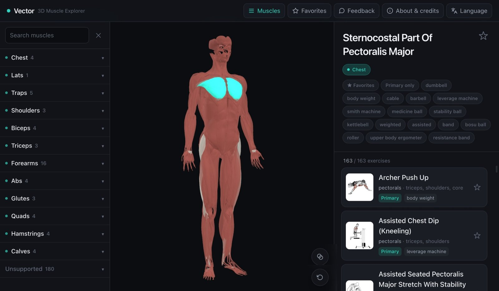

# Vector · 3D Muscle Explorer

A free, interactive 3D muscle explorer on the web. Rotate a **3D human body**, click any muscle, and the right panel lists the **best exercises to train that muscle**, with equipment, step by step instructions and demo animations.

Live: https://vector-3d-muscle.pages.dev



## Features

- Rotatable, clickable 3D anatomy model (467 individual muscle meshes).
- Click a muscle or search the muscle list (searchable in English and Chinese) to see recommended exercises.
- Each exercise has equipment, target and secondary muscles, step by step guides and a demo GIF (full screen lightbox).
- Filter by equipment, primary only, or favourites. Save favourite exercises and muscles (kept in the browser via localStorage).
- Adjustable muscle opacity to see through to deeper muscles.
- 7 languages (English, Traditional Chinese, Spanish, French, Italian, Polish, Turkish); first visit is auto detected.
- No backend, no accounts, no API keys. Everything runs client side.

## Tech stack

| Area | Choice |
|---|---|
| Framework | Vite + React + TypeScript |
| 3D | React Three Fiber (`@react-three/fiber`) |
| 3D helpers | `@react-three/drei` (`useGLTF`, `OrbitControls`) |
| Post FX | `@react-three/postprocessing` (Bloom on highlight) |
| Styling | Tailwind CSS v4 |
| Deploy | Cloudflare Pages (also runs on Vercel) |

## How it works

Three naming schemes do not line up, so a mapping layer bridges them:

```
GLB mesh name (467, anatomical)  ->  muscleId (12, training oriented)  ->  ExerciseDB target string
left_latissimus_dorsi                lats                                  lats
```

- [`src/data/muscleMap.ts`](src/data/muscleMap.ts): mesh name substring to one of 12 training muscle groups.
- [`src/data/muscleNameZh.ts`](src/data/muscleNameZh.ts): Chinese name for each of the 467 meshes, plus `symmetryKey()` (left/right count as one muscle).
- [`src/lib/recommend.ts`](src/lib/recommend.ts): clicked mesh to muscle group.
- [`src/lib/providers/`](src/lib/providers/): pluggable exercise database layer. Swapping databases is a one file change.
- [`src/components/AnatomyModel.tsx`](src/components/AnatomyModel.tsx): loads the GLB, per mesh picking (a drag under 5px counts as a click), symmetric highlight.

> Note: three.js replaces spaces with underscores when it loads the GLB (`left latissimus dorsi` becomes `left_latissimus_dorsi`), so matching normalises spaces first.

## Run it

```bash
npm install
npm run dev      # dev server http://localhost:5173
npm run build    # output to dist/
npm run preview  # preview the build
```

## Asset preprocessing

The 3D model is `anatomy.glb`, borrowed from the open source project [`JohanBellander/BodyExplorer`](https://github.com/JohanBellander/BodyExplorer) (MIT, assets only), compressed with gltf-transform (meshopt):

```bash
# --join false keeps all 467 meshes separate (otherwise per-muscle picking breaks);
# --simplify false keeps the original geometry (avoids holes in thin muscles).
npx @gltf-transform/cli optimize <src>.glb public/anatomy.glb --compress meshopt --join false --simplify false
# 25.13 MB -> 6.88 MB
```

Exercise data comes from [`hasaneyldrm/exercises-dataset`](https://github.com/hasaneyldrm/exercises-dataset) (ExerciseDB, MIT, 1324 exercises with GIFs). Needed fields are packed into `src/data/exercisedb.json`; the non English/Chinese step translations are split into `public/steps/<lang>.json` and lazy loaded to keep the bundle small.

## Licensing

The source code is MIT licensed (see [LICENSE](LICENSE)). CC BY-SA only binds the model assets, it does not spread to the code.

- **Anatomy model**: BodyParts3D © The Database Center for Life Science (CC BY-SA 2.1 JP) / Z-Anatomy (CC BY-SA 4.0)
- **Exercise data**: ExerciseDB, hasaneyldrm/exercises-dataset (MIT)
- **Exercise images/GIFs**: © GymVisual (https://gymvisual.com), used with written permission for this non commercial site at 180×180 with attribution.
